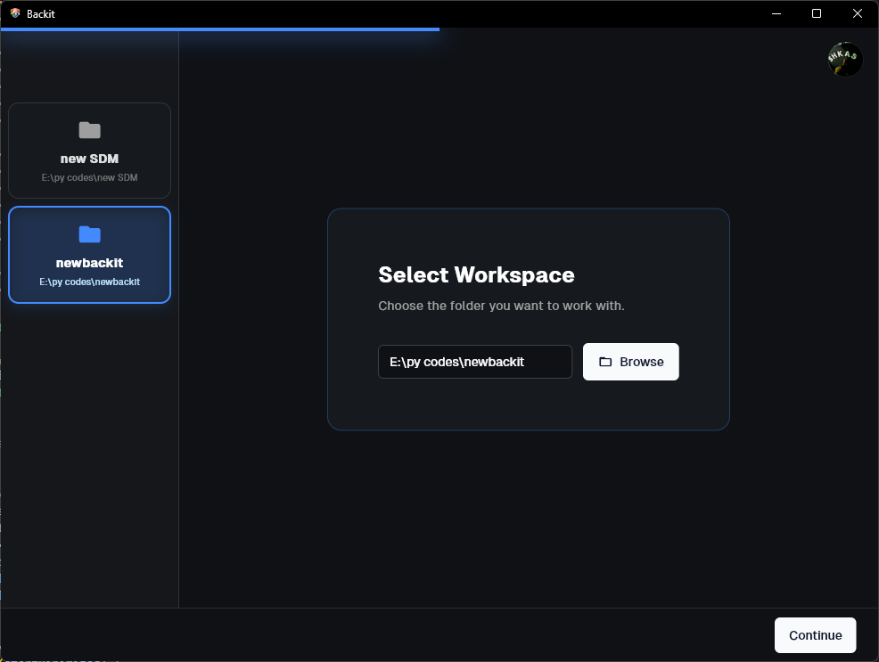
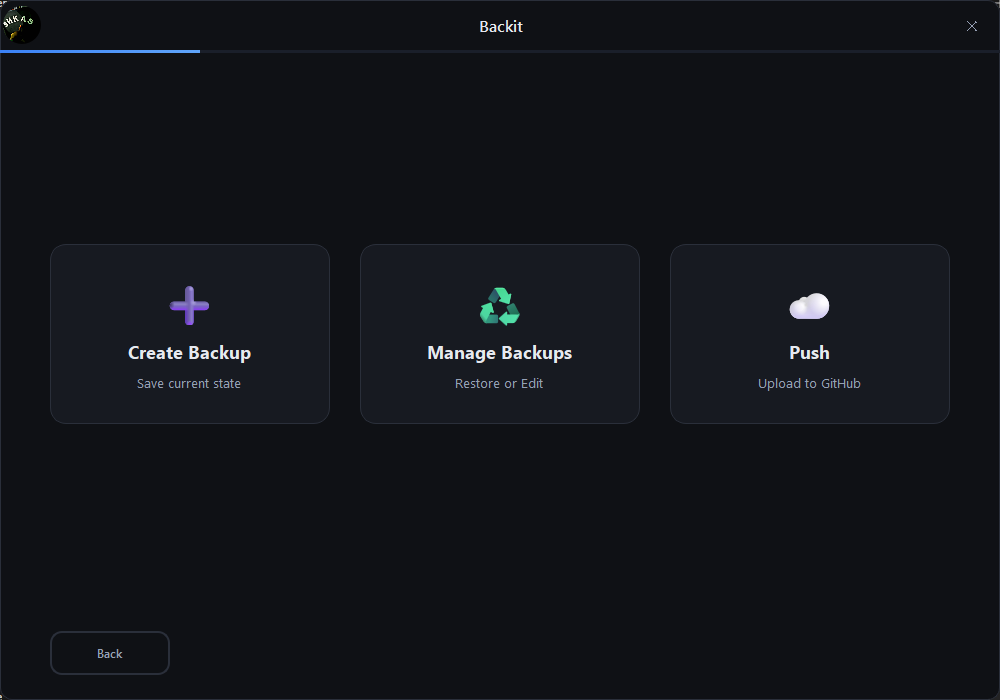
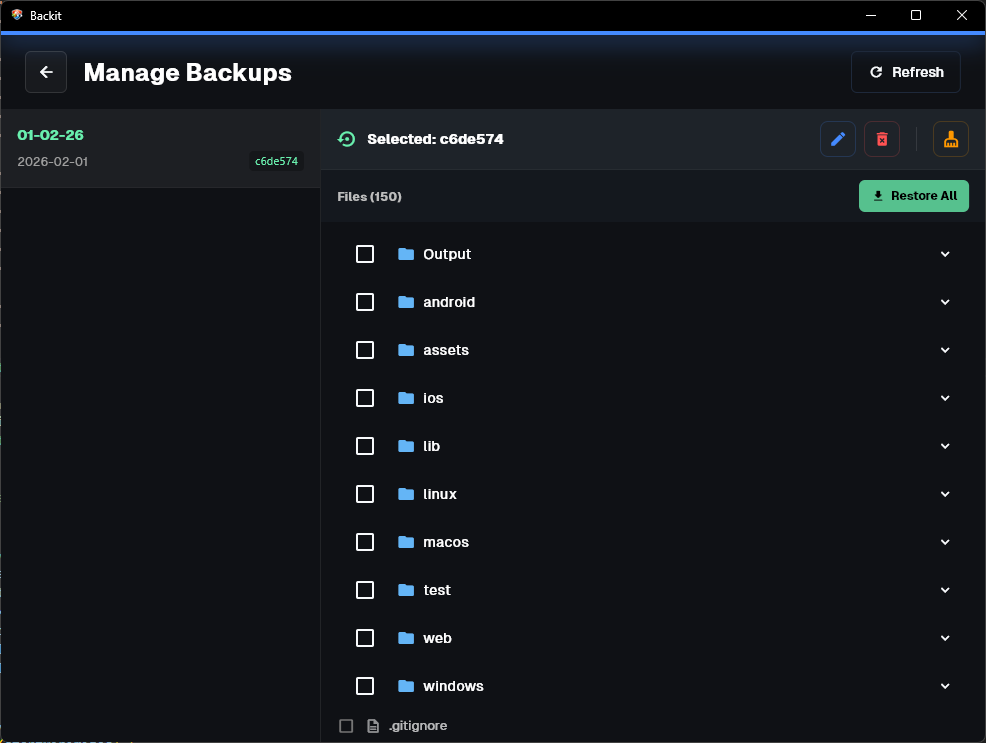

# Backit

**Backit** is a small personal tool built to simplify the idea of *save points* using Git.

I built this tool **with the help of AI in about 2 hours** for **personal use**, because I couldn’t find a simple tool that makes creating, managing, restoring save points, and pushing them easy and straightforward.

  
  

## What does Backit do?

Backit allows you to:

- Create a **save point** (Git commit) at any moment  
- Define a **.gitignore** before creating the save point  
- Manage save points:
  - Rename a save point
  - Delete a save point
  - Set a save point as the main one
  - Delete all save points before it
- **Restore**:
  - A full save point
  - Specific files
  - Specific folders

- **Push** any selected save point to a chosen GitHub repository  
  *(requires signing in to your GitHub account inside the app)*

---

👉 **[Download it from here](../../releases/latest)**
